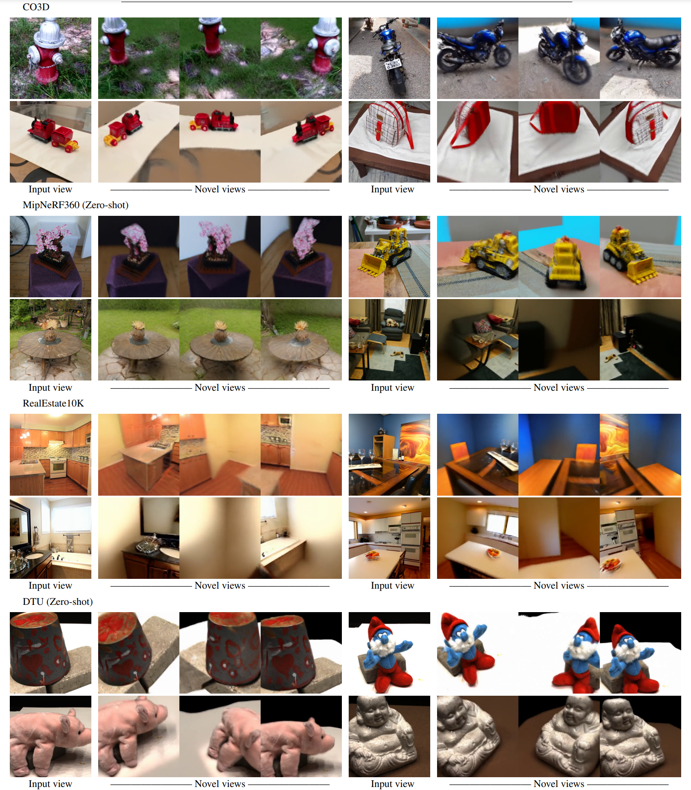

# ZeroNVS

## [Webpage (with video results)](https://kylesargent.github.io/zeronvs/) | [Paper](http://arxiv.org/abs/2310.17994)

This is the offical code release for ZeroNVS: Zero-Shot 360-Degree View Synthesis from a Single Real Image. 



### What is in this repository: 3D SDS distillation code, evaluation code, trained models
In this repository, we currently provide code to reproduce our main evaluations and also to run ZeroNVS to distill NeRFs from your own images. This includes scripts to reproduce the main metrics on DTU and Mip-NeRF 360 datasets. 

### How do I train my own diffusion models?
Check out the companion repository, https://github.com/kylesargent/zeronvs_diffusion.

# Acknowledgement

This codebase is heavily built off existing codebases for 3D-aware diffusion model training and 3D SDS distillation, namely [Zero-1-to-3](https://github.com/cvlab-columbia/zero123) and [threestudio](https://github.com/threestudio-project/threestudio). If you use ZeroNVS, please consider also citing these great contributions.  

# Requirements
The code has been tested on an A100 GPU with 40GB of memory.

To get the code:
```
git clone https://github.com/kylesargent/zeronvs.git
cd zeronvs
```

To set up the environment, use the following sequence of commands. The exact setup that will work for you might be platform dependent. Note: it's normal for installing tiny-cuda-nn to take a long time.
<!-- export TCNN_CUDA_ARCHITECTURES=80 -->

```
conda create -n zeronvs python=3.8 pip
conda activate zeronvs

pip install torch==2.0.1+cu118 torchvision==0.15.2+cu118 --extra-index-url https://download.pytorch.org/whl/cu118
conda install -c "nvidia/label/cuda-11.8.0" cuda-toolkit
pip install ninja git+https://github.com/NVlabs/tiny-cuda-nn/#subdirectory=bindings/torch

pip install -r requirements-zeronvs.txt
pip install nerfacc -f https://nerfacc-bucket.s3.us-west-2.amazonaws.com/whl/torch-2.0.0_cu118.html
```

Finally, be sure to initialize and pull the code in the `zeronvs_diffusion` submodule.
```
cd zeronvs_diffusion
git submodule init
git submodule update
cd ..
```

# Data and models
Since we have experimented with a variety of datasets in ZeroNVS, the codebase consumes a few different types of data formats. 

To download all the relevant data and models, you can run the following commands within the zeronvs conda environment 
```
gdown --fuzzy https://drive.google.com/file/d/1q0oMpp2Vy09-0LA-JXpo_ZoX2PH5j8oP/view?usp=sharing
gdown --fuzzy https://drive.google.com/file/d/1aTSmJa8Oo2qCc2Ce2kT90MHEA6UTSBKj/view?usp=drive_link
gdown --fuzzy https://drive.google.com/file/d/17WEMfs2HABJcdf4JmuIM3ti0uz37lSZg/view?usp=sharing

unzip dtu_dataset.zip
```

## MipNeRF360 dataset
You can download it [here](https://drive.google.com/file/d/1q0oMpp2Vy09-0LA-JXpo_ZoX2PH5j8oP/view?usp=sharing). Be sure to set the appropriate path in `resources.py`

## DTU dataset
Download it [here](https://drive.google.com/file/d/1aTSmJa8Oo2qCc2Ce2kT90MHEA6UTSBKj/view?usp=drive_link) (hosted by the PixelNeRF authors). Be sure to unzip it and then set the approriate path in `resources.py`

## Your own images
Store them as 256x256 png images and pass them to `launch_inference.sh` (details below).

## Models
We release our main model, trained with our $\mathbf{M}_{\mathrm{6DoF+1,~viewer}}$ parameterization on CO3D, RealEstate10K, and ACID. You can download it [here](https://drive.google.com/file/d/17WEMfs2HABJcdf4JmuIM3ti0uz37lSZg/view?usp=sharing). We use this one model for all our main results.

# Inference
Evaluation is performed by distilling a NeRF for each of the scenes in the dataset. DTU has 15 scenes and the Mip-NeRF 360 dataset has 7 scenes. Since NeRF distillation takes ~3 hours, running the full eval can take quite some time, especially if you only have 1 GPU.

Note that you can still achieve good performance with much faster config options; for instance, reduced resolution, batch size, number of training steps, or some combination. The code as-is is just intended to reproduce the results from the paper.

After downloading the data and models, you can run the evals via either `launch_eval_dtu.sh` or `launch_eval_mipnerf360`. The metrics for each scene will be saved in `metrics.json` files which you must average to get the final performance. 

We provide the expected performance for individual scenes in the tables below. Note that there is some randomness inherent in SDS distillation, so you may not get exactly these numbers (though the performance should be quite close, especially on average).

## DTU (expected performance)
ssim | psnr | lpips | scene_uid | manual_gt_to_pred_scale
--- | --- | --- | --- | ---
0.6094 | 13.2329 | 0.2988 | 8.0 | 1.2
0.1739 | 8.4278 | 0.5783 | 21.0 | 1.4
0.6311 | 14.1864 | 0.2332 | 30.0 | 1.5
0.2992 | 8.9569 | 0.5117 | 31.0 | 1.4
0.3862 | 14.049 | 0.3611 | 34.0 | 1.4
0.3495 | 12.6771 | 0.4659 | 38.0 | 1.3
0.4612 | 12.2447 | 0.3729 | 40.0 | 1.2
0.4657 | 12.5998 | 0.3794 | 41.0 | 1.3
0.369 | 11.241 | 0.4441 | 45.0 | 1.4
0.4456 | 17.0177 | 0.4322 | 55.0 | 1.2
0.5724 | 12.6056 | 0.2639 | 63.0 | 1.5
0.5384 | 12.1564 | 0.2725 | 82.0 | 1.5
0.5434 | 16.0902 | 0.3811 | 103.0 | 1.5
0.6353 | 19.5588 | 0.349 | 110.0 | 1.3
0.5529 | 18.2336 | 0.3613 | 114.0 | 1.3

## Mip-NeRF 360 (expected performance)
ssim | psnr | lpips | scene_uid | manual_gt_to_pred_scale
--- | --- | --- | --- | ---
0.1707 | 13.184 | 0.6536 | bicycle | 1.0
0.3164 | 13.1137 | 0.6122 | bonsai | 1.0
0.2473 | 12.2189 | 0.6823 | counter | 0.9
0.207 | 15.2817 | 0.5366 | garden | 1.0
0.254 | 13.2983 | 0.6245 | kitchen | 0.9
0.3431 | 11.8591 | 0.5928 | room | 0.9
0.1396 | 13.124 | 0.6717 | stump | 1.1

## Running on your own images
Use the script `launch_inference.sh`. You will need to specify the image path, field-of-view, camera elevation, and content scale. These don't need to be exact, but badly wrong values will cause convergence failure.


# Citation
If you use ZeroNVS, please cite via:
```
@article{zeronvs,
    author = {Sargent, Kyle and Li, Zizhang and Shah, Tanmay and Herrmann, Charles and Yu, Hong-Xing and Zhang, Yunzhi and Chan, Eric Ryan and Lagun, Dmitry and Fei-Fei, Li and Sun, Deqing and Wu, Jiajun},       
    title = {{ZeroNVS}: Zero-Shot 360-Degree View Synthesis from a Single Real Image},
    journal={arXiv preprint arXiv:2310.17994},
    year={2023}
}
```